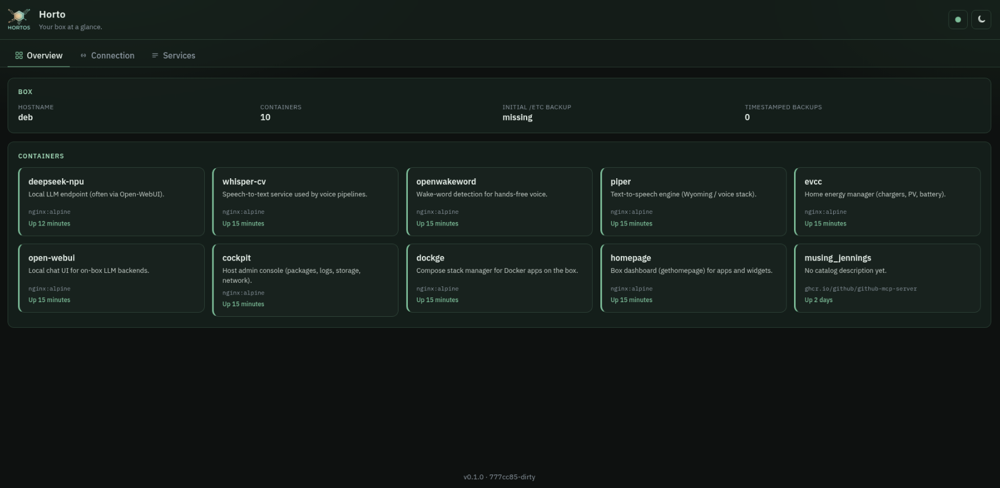
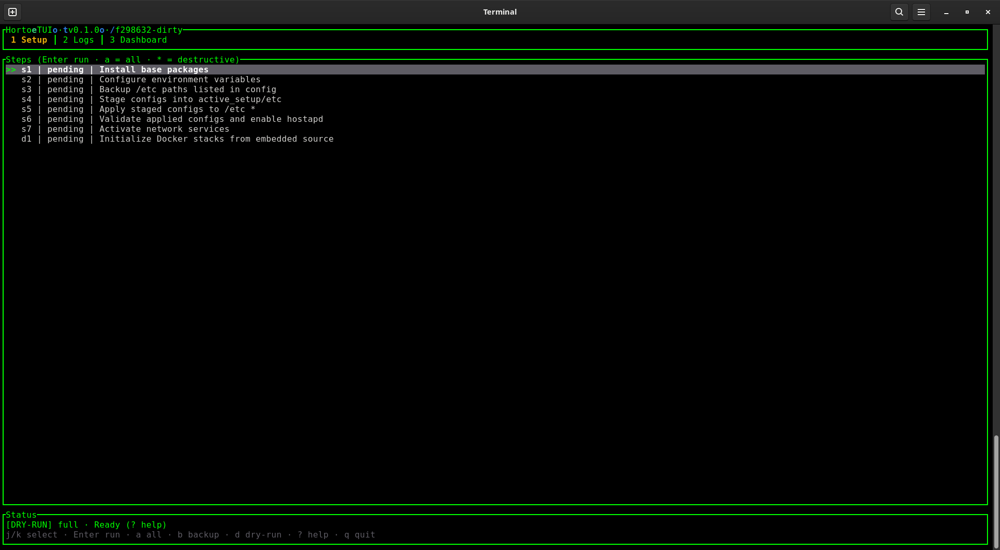
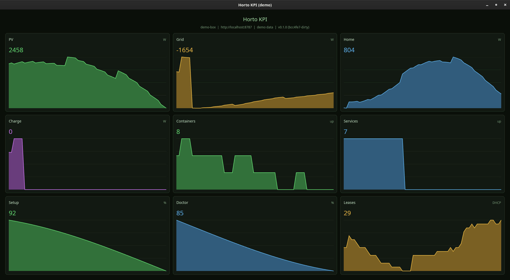

# horto-os-ui

<p align="center">
  
</p>

<p align="center">
  <strong>Rust installer and ops surfaces for a Horto box</strong><br />
  CLI, TUI, and status API on the box · KPI board and desktop client on a PC
</p>

<p align="center">
  <a href="https://github.com/Hortos-Network/horto-os-ui/actions/workflows/ci-shared.yml"></a>
  <a href="https://github.com/Hortos-Network/horto-os-ui/actions/workflows/ci-cli.yml"></a>
  <a href="https://github.com/Hortos-Network/horto-os-ui/actions/workflows/ci-tui.yml"></a>
  <a href="https://github.com/Hortos-Network/horto-os-ui/actions/workflows/ci-status-api.yml"></a>
  <a href="https://github.com/Hortos-Network/horto-os-ui/actions/workflows/ci-kpi.yml"></a>
  <a href="https://github.com/Hortos-Network/horto-os-ui/actions/workflows/ci-desktop.yml"></a>
  <a href="https://codecov.io/gh/Hortos-Network/horto-os-ui/tree/dev"></a>
</p>

Templates under `assets/` are embedded at compile time. No separate shell-script checkout is required at runtime.

Integration branch: **`dev`**. Canonical repo: [Hortos-Network/horto-os-ui](https://github.com/Hortos-Network/horto-os-ui).

## What you get today

| Piece             | Role                                                                |
| ----------------- | ------------------------------------------------------------------- |
| **Shared engine** | Versioned setup steps, Docker staging, doctor, backup, status model |
| **CLI**           | Dry-run / apply installer and day-2 ops (`horto-os-ui`); `--remote` for PC→box |
| **TUI**           | Ratatui wizard: Setup / Logs / Overview; `--remote` for PC→box                 |
| **Status API**    | Box-local HTTP `/health` + `/v1/status` for LAN clients             |
| **KPI board**     | GPUI 3x3 live charts (demo or live API / EVCC)                      |
| **Web + desktop** | Leptos CSR SPA + Tauri homeowner shell (Desktop always remote)      |

Embedded assets under `assets/config/` and `assets/docker_source/` replace a runtime shell-script checkout.

## Screenshots

| Desktop                                   | TUI                               | KPI board                         |
| ----------------------------------------- | --------------------------------- | --------------------------------- |
|  |  |  |

## Surfaces

| Surface    | Crate / binary           | Make                       |
| ---------- | ------------------------ | -------------------------- |
| Engine     | `horto-os-ui-shared`     | (library)                  |
| CLI        | `horto-os-ui`            | `make cli` / `make status` |
| TUI        | `horto-os-ui-tui`        | `make tui`                 |
| Status API | `horto-os-ui-status-api` | `make api`                 |
| Ops KPI    | `horto-os-ui-kpi`        | `make kpi`                 |
| Web UI     | `horto-os-ui-web`        | `make desktop-web`         |
| Desktop    | `horto-os-ui-desktop`    | `make desktop`             |

## Quick start

Prerequisites: Rust stable; Linux + X11 for KPI / desktop; `cargo install trunk` for web / desktop; root only for apply mode on a real box.

Default Cargo members (fast path): shared, CLI, TUI, status-api. KPI and desktop are opt-in via Make.

```bash
git clone https://github.com/Hortos-Network/horto-os-ui.git
cd horto-os-ui
make lint && make test
```

```bash
# terminal A: status API
make api
# http://127.0.0.1:8787/health
# http://127.0.0.1:8787/v1/status

# terminal B: KPI board (demo charts by default) or TUI
make kpi
# make tui
```

Point the KPI board at a real box and turn off demo data:

```bash
make kpi HORTO_BOX_URL=http://192.168.1.10:8787 ARGS='--demo false'
```

Desktop homeowner shell (Trunk release + Tauri window):

```bash
make desktop
# UI talks to HORTO_BOX_URL (default http://localhost:8787)
```

## Docs

| Doc                                                                                                     | Topic                                          |
| ------------------------------------------------------------------------------------------------------- | ---------------------------------------------- |
| [tools/modes.md](tools/modes.md)                                                                                    | Embedded vs remote modes, OpenSSH auth, key opt-in |
| [tools/shared.md](tools/shared.md) · [crate README](../crates/horto-os-ui-shared/README.md)             | Shared engine (steps, doctor, backup, status)  |
| [tools/cli.md](tools/cli.md) · [crate README](../crates/horto-os-ui-cli/README.md)                      | CLI installer and day-2 ops                    |
| [tools/tui.md](tools/tui.md) · [crate README](../crates/horto-os-ui-tui/README.md)                      | Ratatui Setup / Logs / Overview                |
| [tools/status-api.md](tools/status-api.md) · [crate README](../crates/horto-os-ui-status-api/README.md) | Box-local HTTP `/health` + `/v1/status`        |
| [tools/kpi.md](tools/kpi.md) · [crate README](../crates/horto-os-ui-kpi/README.md)                      | GPUI KPI board                                 |
| [tools/web.md](tools/web.md) · [crate README](../crates/horto-os-ui-web/README.md)                      | Leptos CSR web UI                              |
| [tools/desktop.md](tools/desktop.md) · [crate README](../crates/horto-os-ui-desktop/README.md)          | Tauri homeowner shell                          |
| [TIP_SYNC.md](TIP_SYNC.md)                                                                              | Absorb checklist when tip shell scripts change |
| [CONTRIBUTING.md](CONTRIBUTING.md)                                                                      | Lint bar, Make habits, PR rules                |
| [CODE_OF_CONDUCT.md](CODE_OF_CONDUCT.md)                                                                | Community standards                            |
| [SECURITY.md](SECURITY.md)                                                                              | Vulnerability reporting                        |
| [pull_request_template.md](pull_request_template.md)                                                    | Summary + Test plan                            |
| `make help`                                                                                             | Full Make catalog                              |
| `make doc`                                                                                              | rustdoc → `docs/api-rust/`                     |

## Build

```bash
make build              # default packages (shared, cli, tui, status-api)
make build-release      # same, release profile
make build-kpi          # GPUI KPI binary
make build-all          # default + kpi
make build-desktop      # Trunk web + release Tauri binary (no open)
make check              # cargo check default packages
make check-all          # cargo check whole workspace
```

## Run each surface

### CLI (`horto-os-ui`)

Dry-run is the default for Make helpers (safe on a laptop). Drop it with `DRY_RUN=0` or `APPLY=1`.

```bash
make status                              # setup status
make doctor
make docker-status
make setup-run                           # full pipeline dry-run
make setup-step STEP=s1
make backup-status
make backup-etc
make backup-disk-status
make cli ARGS='setup status --minimal'
make cli ARGS='net leases'
make cli ARGS='docker rebuild --dir /srv/docker/homepage'
make cli DRY_RUN=0 ARGS='doctor'         # apply mode when you mean it
```

Apply on a real box (root):

```bash
sudo horto-os-ui setup run --full
sudo horto-os-ui setup step s5
sudo horto-os-ui docker init
sudo horto-os-ui backup etc
sudo horto-os-ui backup etc --initial
```

### Backup commands

| Command                                 | What                                                                   |
| --------------------------------------- | ---------------------------------------------------------------------- |
| `horto-os-ui backup etc`                | Timestamped managed `/etc` copy → `/srv/backup/etc/YYYYMMDD-HHMMSS`    |
| `horto-os-ui backup etc --initial`      | Protected initial tree (same as setup step s3)                         |
| `horto-os-ui backup list`               | List timestamped backups                                               |
| `horto-os-ui backup disk-status`        | Probe readiness (safe anytime)                                         |
| `horto-os-ui backup disk`               | partclone eMMC image; **refuses if root is eMMC** (boot from SD first) |
| `horto-os-ui backup shrink --dest PATH` | Optional shrink-backup wrapper if that tool is on PATH                 |
| `horto-os-ui backup status`             | JSON for API / soft client                                             |

Disk backup is destructive if aimed at the wrong device. Defaults: source `/dev/mmcblk0p1`, dest `/mnt/external/horto-os`. Use `--boot-sectors` for the first 4MiB of `/dev/mmcblk0`. `--force` only relaxes “root not clearly SD/USB”; it never overrides eMMC-root detection.

Optional: `HORTO_APPLY_NAT=1` to apply NAT rules in s7 without a prompt. `--skip-piper` skips the piper model download during docker init.

### TUI (`horto-os-ui-tui`)

```bash
make tui                 # dry-run wizard: Setup / Logs / Overview
make tui-release         # release binary, dry-run
make tui DRY_RUN=0       # apply mode (needs privileges for writes)
sudo horto-os-ui-tui     # apply mode on a real box
```

Keys: `?` help; Tab / 1-3 screens; arrows select steps; Enter runs the selected step; `a` pipeline; `b` / `B` backup / disk probe; `r` refresh; `d` dry-run; `q` / Esc / Ctrl+C quit (tty restored). Mouse capture is off so you can select and copy text.

### Status API (`horto-os-ui-status-api`)

```bash
make api                                 # API_BIND=0.0.0.0:8787
make api API_BIND=127.0.0.1:8787
curl -sS http://127.0.0.1:8787/health
curl -sS http://127.0.0.1:8787/v1/status | head
```

- `GET /health` always open
- `GET /v1/status` JSON: hostname, setup summary, doctor, backup, containers, URLs, leases

If `HORTO_API_TOKEN` is set, protected routes require `Authorization: Bearer <token>`. If unset, the API warns at startup and stays open on the bind address for early LAN use.

### KPI board (`horto-os-ui-kpi`)

View-only 3x3 live charts. No remote install, apt, netplan, or backup apply.

```bash
make kpi                                 # demo series on by default
make kpi ARGS='--demo false'             # live /health + /v1/status (+ EVCC if linked)
make kpi HORTO_BOX_URL=http://box:8787 ARGS='--demo false'
make kpi HORTO_EVCC_URL=http://box:7070 ARGS='--demo false'
# HORTO_KPI_POLL_SECS=1  HORTO_KPI_HISTORY=60
```

### Web + desktop

PC product shell (Tauri 2) embeds the Leptos CSR web UI. The SPA talks to `horto-os-ui-status-api` on the box. No privileged remote install from the desktop app.

```bash
make desktop-web              # Trunk release → crates/horto-os-ui-web/dist
make desktop-web-serve        # Trunk serve on :4187 (dev iteration)
make desktop                  # Trunk release + open Tauri window
make build-desktop            # build only, do not open
```

Point the UI at the box (`http://<box>:8787`). Set a bearer token when the API requires `HORTO_API_TOKEN`.

## Quality gates

```bash
make help
make format                 # rustfmt write
make lint                   # fmt --check + clippy (default packages)
make test                   # default packages
make test-all               # whole workspace
make ci                     # lint + test + audit + deny + machete
make coverage-summary       # llvm-cov summary (needs cargo-llvm-cov)
make coverage-shared        # shared crate gate (fail-under)
make coverage-html          # HTML report under target/
make audit
make deny
make machete
make outdated
make doc / make doc-open
```

GitHub Actions runs per-crate workflows on `dev` / PRs (path filters). Coverage for the shared engine uploads to [Codecov](https://codecov.io/gh/Hortos-Network/horto-os-ui).

## Install / package

```bash
make install                # release CLI, TUI, status-api → ~/.local/bin
make install-kpi            # also horto-os-ui-kpi
make uninstall
make release-bins           # dist/*.tar.gz + sha256
make deb                    # needs: cargo install cargo-deb
make bins
make version-show
make clean
```

Override install prefix: `make install PREFIX=/usr/local`.

GitHub Release workflow also attaches naked tar.gz (amd64/arm64) and `.deb` when remotes exist.

## Useful overrides

| Variable            | Default                 | Used by                               |
| ------------------- | ----------------------- | ------------------------------------- |
| `API_BIND`          | `0.0.0.0:8787`          | `make api`                            |
| `HORTO_BOX_URL`     | `http://localhost:8787` | `make kpi`, desktop                   |
| `HORTO_API_TOKEN`   | (unset)                 | API clients                           |
| `HORTO_EVCC_URL`    | (from status links)     | KPI energy tiles                      |
| `HORTO_KPI_DEMO`    | `true`                  | KPI synthetic charts                  |
| `DRY_RUN` / `APPLY` | `1` / `0`               | CLI / TUI Make helpers                |
| `ARGS`              | empty                   | Extra argv for `make cli` / `kpi` / … |
| `STEP`              | `s1`                    | `make setup-step`                     |
| `PREFIX`            | `$HOME/.local`          | `make install`                        |

## Testing notes

- `--dry-run` and unit tests cover planning on a normal Linux workstation.
- Docker compose bring-up from staged `/srv/docker` covers stack packaging.
- Full host networking (netplan, hostapd, dnsmasq-as-host, NAT) needs a QEMU/KVM guest or a real board. Docker alone is not a fake Horto box.
- Full eMMC image backup needs a temporary SD/USB boot; dry-run / `backup disk-status` work on a workstation.

### Guest / board apply

Privileged `setup run` / `setup step s5`–`s7` must be proven on a guest or board, not only with `--dry-run` on a developer laptop.

1. Boot a Debian or Armbian-like **QEMU/KVM** guest (or use a real RK3588).
2. Install release or locally built `horto-os-ui` / `horto-os-ui-tui` into the guest.
3. Run `horto-os-ui --dry-run setup run --full` first; confirm step plan and paths.
4. Apply with `sudo horto-os-ui setup run --full` (or step-by-step). Expect netplan / hostapd / dnsmasq / NAT side effects.
5. Re-check with `horto-os-ui doctor`, `docker status`, and `GET /v1/status` from the status API.

Workstation dry-run proofs (`make status`, `make setup-run`, `make docker-status`) stay useful for planning, but they do not replace the guest/board gate.

## Tracking horto-os script changes

One Rust module per reference script under `crates/horto-os-ui-shared/src/steps/`:

| Step | Reference script         |
| ---- | ------------------------ |
| s1   | s1_init_horto_os.sh      |
| s2   | s2_init_env_vars.sh      |
| s3   | s3_backup_etc_configs.sh |
| s4   | s4_deploy_configs.sh     |
| s5   | s5_apply_configs.sh      |
| s6   | s6_validate_configs.sh   |
| s7   | s7_activate_services.sh  |
| m1   | m1_minimal_setup_run.sh  |
| d1   | d1_docker_init.sh        |

Related helpers (not setup steps): `timestamped_backup_etc_configs.sh`, `partclone_backup_sda5.sh`, `docker_rebuild.sh` → `horto-os-ui backup …` / `horto-os-ui docker rebuild`.

When a script changes: follow [TIP_SYNC.md](TIP_SYNC.md). Update that module (and embedded assets if needed), bump `step_version` if resume semantics change, then re-run `cargo test -p horto-os-ui-shared`.

### Errors and logging

- Engine (`horto-os-ui-shared`): typed `HortoError` via `thiserror`.
- Binaries: `anyhow` at `main`; `?` converts `HortoError`.
- `tracing` events from the engine; CLI/API install `tracing-subscriber` (`RUST_LOG`). TUI keeps step output in its Logs pane.

## Contributing

1. Read [CONTRIBUTING.md](CONTRIBUTING.md).
2. Prefer Make aliases (`make help`) over long `cargo run -p …` lines.
3. Local gate before push: **`make ci`** (or at least `make lint` + `make test`).
4. One concern per PR. English in commits and docs. Body: [pull_request_template.md](pull_request_template.md).

## License

Apache-2.0. See [LICENSE](../LICENSE).
